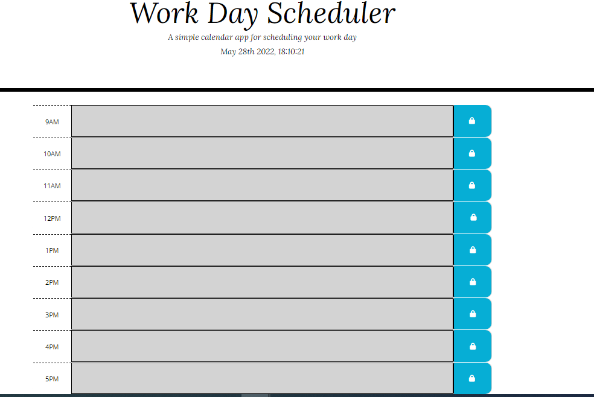

# WORK DAY SCHEDULER

## Table of Contents
- [Description](#description)
- [Expectations](#expectations)
- [References](#references)
- [Deployed Site Link](#deployed-site)

## Description
- A simple calender app for scheduling appointments and planning out your work day. This project utilizes Jquery, JavaScript and Bootstrap.

## Expectations
- You will find..
- WHEN you open the planner
    - THEN the current day is displayed at the top of the calendar
- WHEN you scroll down
    - THEN you are presented with timeblocks for standard business hours
- WHEN you view the timeblocks for that day
    - THEN each timeblock is color coded to indicate whether it is in the past, present, or future
- WHEN you click into a timeblock
    - THEN you can enter an event
- WHEN you click the save button for that timeblock
    - THEN the text for that event is saved in local storage
- WHEN you refresh the page
    - THEN the saved events is still present

## References

## Deployed Site Link/ Github Pages
 https://altheahanson.github.io/workdayscheduler/

